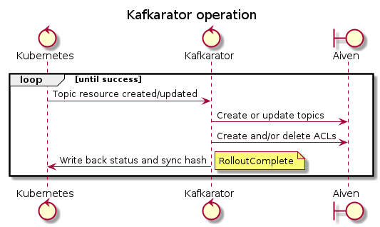

# Kafkarator

Kafkarator is a Kubernetes operator on the [NAIS platform](https://doc.nais.io), providing
self-service functionality for Aiven hosted Kafka through Kubernetes resources.

Kafkarator defines a _Kubernetes custom resource_, `kafka.nais.io/Topic`. When users create or update this resource,
Kafkarator translates it to Aiven _topics_ and _ACL entries_.

## User documentation

* https://doc.nais.io/persistence/kafka/

## Developer documentation

Kafkarator uses [earthly](https://earthly.dev) via [earthlyw](https://github.com/mortenlj/earthlyw) for building.

Use `./earthlyw +docker` to build docker images for kafkarator and canary.
