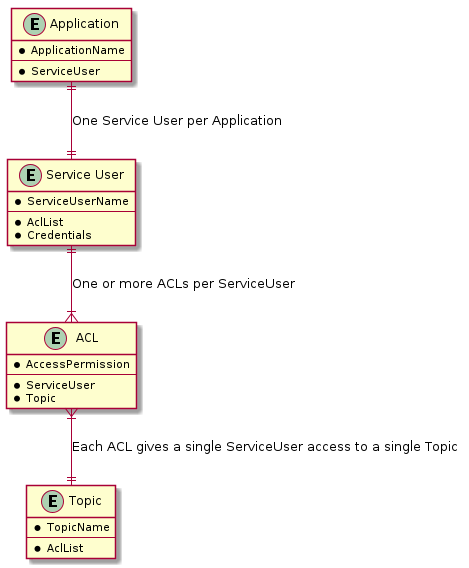
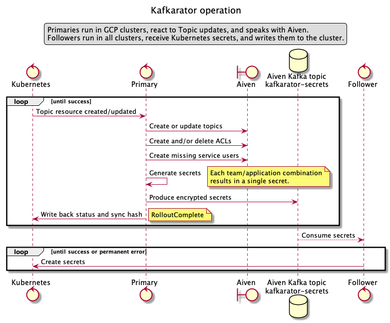
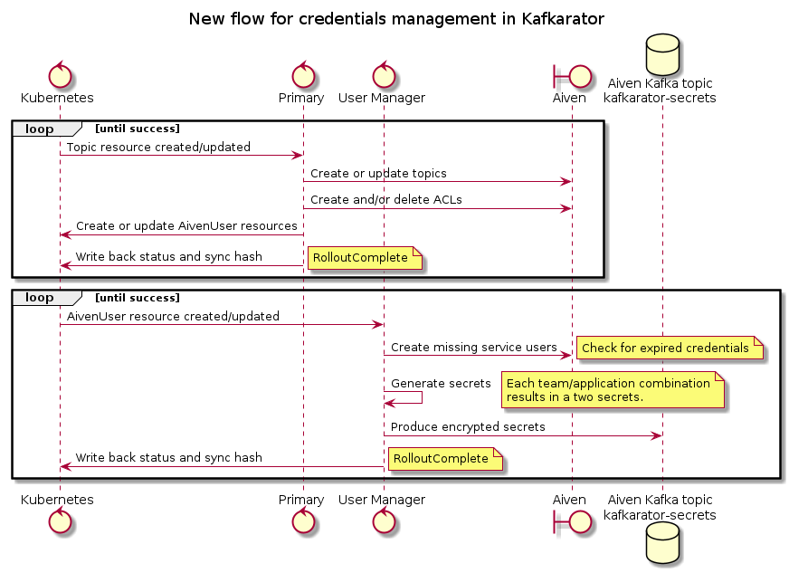
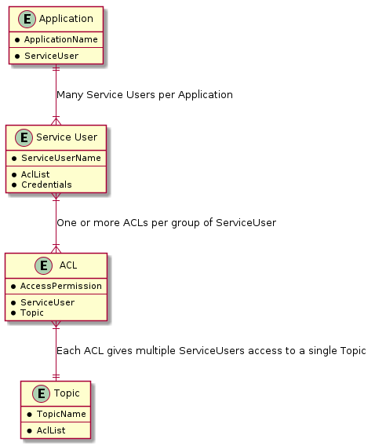

# 5. Kafkarator credentials rotation and flow

Date: 2021-04-22

## Status

Accepted

## Context

### Credentials are available as both files and environment variables

Credentials are made available in the clusters as secrets with an expected name.
Naiserator deploys applications with their requested Credential's properties as both _environment variables_ and _files_ in a mounted volume.

Some properties in the Credential are not made available as environment variables, because their names make for invalid environment variables.
All properties of a Credential are available as files in the mounted volume.

### Credential rotation triggered by manual topic edit and on a schedule

Kafkarator processes topics based on events from the Kubernetes API server.
These events are `Added`, `Modified`, and `Deleted`. 
In addition, it will request a full list of topics from the Kubernetes API server every hour.

Events will typically happen when a developer makes changes to the Topic's Kubernetes resource.
For instance when:
- adding an application to the topic's ACLs
- changing topic configuration
- removing an application from the topic's ACLs

### Credentials expire on a "faulty schedule"

When Kafkarator processes a topic, it will generate any necessary service users, ACLs, and Credentials.
When making (or rotating) a Credential, it records the expiration timestamp of the Credential in the status-field of the Topic's Kubernetes resource.

Thus, when processing a topic Kafkarator checks the expiration timestamp recorded on the Topic's Kubernetes resource, and if that timestamp is in the past, rotate _all_ the Credentials in use for accessing the Topic being processed.
With the current implementation, an application can use the same Credential to access multiple topics, and thus risk multiple independent expiration timestamps (one per Topic) triggering rotation of its Credentials.

This implementation detail brings not only the consequence of more frequent rotation of Credentials than intended, but also triggers rotation of Credentials at unforeseen/unexpected times.

### All applications attached to a topic has their credentials rotated at the same time

Due to the same implementation details as [discussed here](#credentials-expire-on-a-faulty-schedule), when the expiration timestamp recorded on a topic has passed, all applications with access to that topic will have their Credentials rotated.

This has resulted in massive Credential purges (and subsequent restarts) of applications with access to topics with many producers and consumers.

### Kafkarator purges all service users when processing a topic

When a topic is updated, the synchronization loop in Kafkarator kicks in. 
As part of this loop, all service users are re-created, rotating their credentials. 

### Some teams have legacy systems that can't make use of auto-rotated credentials

Some teams have legacy systems that are not able to run in the NAIS platform's clusters at this time.
This makes it difficult for them to make use of Aiven Kafka, since their applications can not get automated access to rotated Credentials.

### Current flow

Kafkarator has two modes of operation: Primary and Follower.

Follower is only responsible for maintaining secrets in the non-gcp clusters, in response to events sent to it from the Primary.
Primary takes care of managing topics, service users, ACLs and credentials.

In the Primary main loop, the steps are roughly these:

1. Create or update topics
2. Create and/or delete ACLs
3. Re-create service users
4. Generate secrets
5. Produce encrypted secrets to send to Follower
6. Write back status and sync hash

### Deterministic names

Names of service users, and secrets are deterministically generated and possible to recreate with only name and namespace of the owning application.

### There is a limit to the number of service users we can have in each Aiven project

Aiven has a limit to the number of service users allowed. This current limit is 1000 service users for nav-dev and nav-prod projects. This is "the maximum that has been applied so far for any customer".

### Rotation is a security feature

One way to solve these problems would be to drop rotation entirely.
Instead we could rely on manual rotation when we discover that we need it.

From a security perspective, that is not something we consider good enough.

### Other NAIS operators dealing with credentials

NAIS operates a number of operators, some of which deal with credentials.
A common pattern is Just-in-time provisioning of credentials. 
In this model credentials are generated/rotated on each deploy, which would remove much of the problems we have today.

## Decision

### New synchronization flow

We will split the loop into two parts.
The existing main loop will now perform these steps:

1. Create or update topics
2. Create and/or delete ACLs, using wildcards to match a set of service users
3. Write back status and sync hash

When Naiserator deploys an application that requests kafka access, Naiserator will create the Deployment with a reference to a new secret.
At the same time, it will create an AivenApplication resource, naming that secret.

A new loop or possibly an entirely new operator will respond to AivenApplication resources and perform these steps:

1. Create service user in Aiven
2. Create secret in cluster
3. Write back status and sync hash
4. Delete obsolete secrets in cluster
5. Delete obsolete service users in Aiven

This solves the problem of a topic's expiration timestamp triggering rotation, and provides a place to store additional information for each application.

Information in AivenApplication:

- Name of secret
- Aiven service (starting with only Kafka)
    - Pool (Kafka cluster in Aiven) this application uses

### Overlapping valid credentials

On every deploy of an application, a service user will be created for it. 
This ensures fresh credentials on every deploy.

Existing service users are not touched unless no longer in use.

### Deterministic names for service users

Service users need to have a fixed prefix, generated from application name, so that ACLs can be written to match using wildcards.

### Monitor number of service users

Since service users are a limited resource (at Aiven.io), we need to ensure that we monitor their numbers.
When we approach this limit, we must take steps to handle it - like requesting Aiven.io to increase the limit.

## Consequences

1. The number of service users generated for Kafka will increase.
   It is likely that this limit can be increased.
2. Complexity in Kafkarator increases, with an additional resource to manage.
   This might be mitigated by separating the handling of credentials/users into a separate operator
3. Rotation of credentials will happen at deploy for each application.
4. Legacy applications can manually create an AivenApplication resource to get credentials.
   These credentials can be rotated by updating the AivenApplication resource manually.
5. We no longer need to propagate secrets between primary/follower using Kafka, as credentials are generated where the application lives.
   Primary/follower concept is no longer needed.
