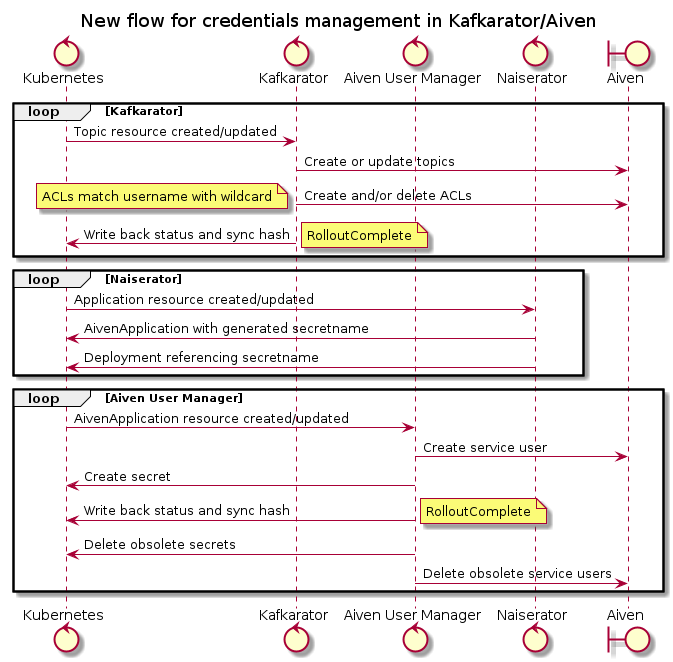

# 8. Kafkarator credentials rotation and flow

Date: 2021-04-12

## Status

Proposed

## Context

### Credentials are available as both files and environment variables

Credentials are made available in the clusters as secrets with an expected name.
Naiserator deploys applications with their requested Credential's properties as both _environment variables_ and _files_ in a mounted volume.

Some properties in the Credential are not made available as environment variables, because their names make for invalid environment variables.
All properties of a Credential are available as files in the mounted volume.

### Credential rotation triggered by manual topic edit and on a schedule

Kafkarator processes topics based on events from the Kubernetes API server.
These events are `Added`, `Modified`, and `Deleted`. 
In addition, it will request a full list of topics from the Kubernetes API server every hour.

Events will typically happen when a developer makes changes to the Topic's Kubernetes resource.
For instance when:
 - adding an application to the topic's ACLs
 - changing topic configuration
 - removing an application from the topic's ACLs

### Credentials expire on a "faulty schedule"

When Kafkarator processes a topic, it will generate any necessary service users, ACLs, and Credentials.
When making (or rotating) a Credential, it records the expiration timestamp of the Credential in the status-field of the Topic's Kubernetes resource.

Thus, when processing a topic Kafkarator checks the expiration timestamp recorded on the Topic's Kubernetes resource, and if that timestamp is in the past, rotate _all_ the Credentials in use for accessing the Topic being processed.
With the current implementation, an application can use the same Credential to access multiple topics, and thus risk multiple independent expiration timestamps (one per Topic) triggering rotation of its Credentials.

This implementation detail brings not only the consequence of more frequent rotation of Credentials than intended, but also triggers rotation of Credentials at unforeseen/unexpected times.

### All applications attached to a topic has their credentials rotated at the same time

Due to the same implementation details as [discussed here](#credentials-expire-on-a-faulty-schedule), when the expiration timestamp recorded on a topic has passed, all applications with access to that topic will have their Credentials rotated.

This has resulted in massive Credential purges (and subsequent restarts) of applications with access to topics with many producers and consumers.

### All applications attached to a topic has their credentials rotated whenever there is a change to the topic

When a topic is updated, the synchronization loop in Kafkarator kicks in. 
As part of this loop, all service users are re-created, rotating their credentials. 

### Some teams have legacy systems that can't make use of auto-rotated credentials

Some teams have legacy systems that are not able to run in the NAIS platform's clusters at this time.
This makes it difficult for them to make use of Aiven Kafka, since their applications can not get automated access to rotated Credentials.

### Current flow

Kafkarator has two modes of operation: Primary and Follower.

Follower is only responsible for maintaining secrets in the non-gcp clusters, in response to events sent to it from the Primary.
Primary takes care of managing topics, service users, ACLs and credentials.

In the Primary main loop, the steps are roughly these:

1. Create or update topics
2. Create and/or delete ACLs
3. Re-create service users
4. Generate secrets
5. Produce encrypted secrets to send to Follower
6. Write back status and sync hash

### Deterministic names

Names of service users, and secrets are deterministic generated and possible to recreate with only name and namespace of the owning application.

### There is a limit to the number of service users we can have in each Aiven project

Aiven has a limit to the number of service users allowed. This current limit is 1000 service users for nav-dev and nav-prod projects. This is "the maximum that has been applied so far for any customer".

## Decision

### New synchronization flow

We will split the loop in two parts. The existing main loop will now perform these steps:

1. Create or update topics
2. Create and/or delete ACLs
3. Create or update an AivenApplication resource for each application with access to the topic
4. Write back status and sync hash

A new loop will take over the management of AivenApplications and perform these steps:

1. Create or update service users in Aiven
2. Check for expired credentials
3. Generate needed secrets
5. Produce encrypted secrets to send to Follower
6. Write back status and sync hash

This solves the problem of a topic's expiration timestamp triggering rotation, and provides a place to store additional information for each application.

Additional information we need:

- List of service users for this application
- Expiration timestamps for service user' credentials
- Configuration for the application
  - Rotation interval

Most of these fields will be managed by Kafkarator, but should be editable by the team that owns the application.

### Overlapping valid credentials

To allow applications a smoother transition during Credentials rotation, this proposed solution will maintain two sets of valid credentials for every application.
Each set of credentials should be rotated on different days (odd and even days of the month for instance), and with a suitable interval.
When one set of credentials are rotated, update the application secret with the latest version.

### Deterministic names for service users

Since we will change to two service users for every application, we need to change our naming convention.
We will make sure the names continue to be deterministic.

### Monitor number of service users

Since service users are a limited resource (at Aiven.io), we need to ensure that we monitor their numbers.
When we approach this limit, we must take steps to handle it - like requesting Aiven.io to increase the limit.

### Add option to disable auto-rotation of credentials

To allow applications on legacy platforms to use Aiven, we should make it possible to configure rotation interval.
It should be possible to disable the rotation interval with this configuration.

## Consequences

1. The number of service users generated for Kafka will double.
   It is likely that this limit can be increased.
2. Complexity in Kafkarator increases, with an additional resource to manage.
3. It will be possible for teams to control the frequency of credentials rotation (within limits).
4. Rotation of credentials will happen at predictable times for each application.
